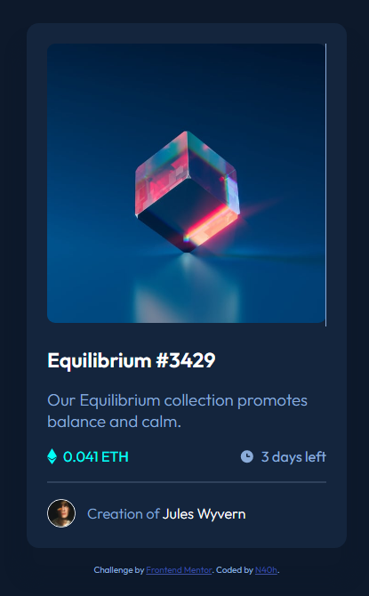

# Frontend Mentor - NFT preview card component solution

This is a solution to the [NFT preview card component challenge on Frontend Mentor](https://www.frontendmentor.io/challenges/nft-preview-card-component-SbdUL_w0U).

## Table of contents

- [Overview](#overview)
  - [The challenge](#the-challenge)
  - [Screenshot](#screenshot)
  - [Links](#links)
- [My process](#my-process)
  - [Built with](#built-with)
  - [What I learned](#what-i-learned)

## Overview

### The challenge

Users should be able to:

- View the optimal layout depending on their device's screen size
- See hover states for interactive elements

### Screenshot



### Links

- Solution URL: [Solution](https://www.frontendmentor.io/solutions/nft-preview-card-component-using-flexbox-mYKvgfcLrx)
- Live Site URL: [Live Site](https://jazzy-pavlova-04d2af.netlify.app/)

## My process

### Built with

- Semantic HTML5 markup
- CSS custom properties
- Flexbox

### What I learned

Add a background on hover of an image

```css
.nft-container {
	width: 100%;
	padding: 1.6rem;
	position: relative;
}

#nft {
	border-radius: 10px;
	display: block;
	width: 100%;
	height: auto;
}

.overlay {
	position: absolute;
	top: 6.5%;
	bottom: 6.5%;
	left: 6.5%;
	right: 6.5%;
	border-radius: 10px;
	opacity: 0;
	transition: 0.5s ease;
	background-color: var(--cyan);
}

.nft-container:hover .overlay {
	cursor: pointer;
	opacity: 0.5;
}

#view {
	position: absolute;
	top: 50%;
	left: 50%;
	width: 15%;
	transform: translate(-50%, -50%);
}
```
